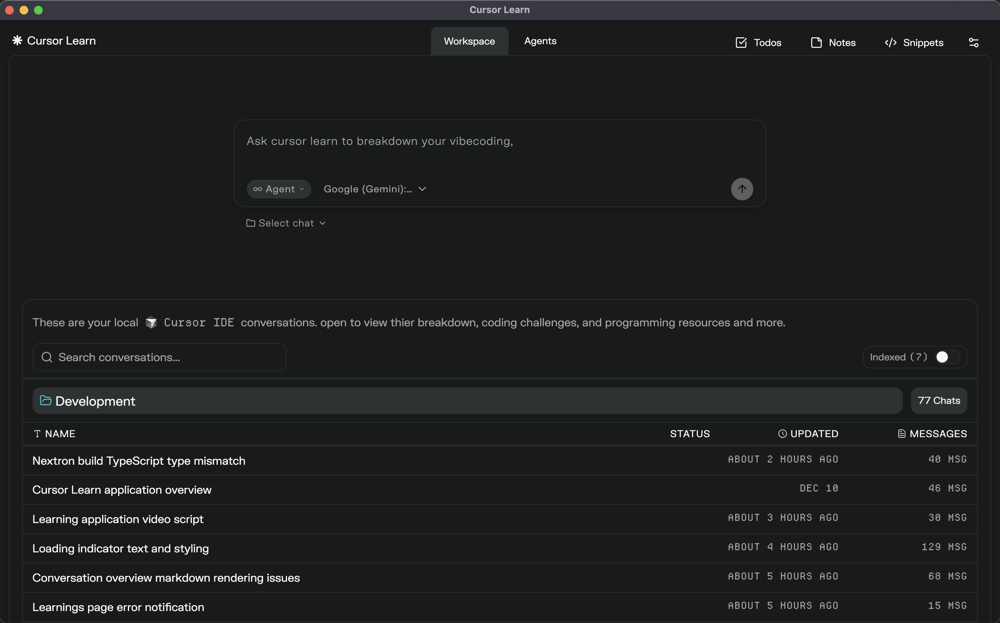
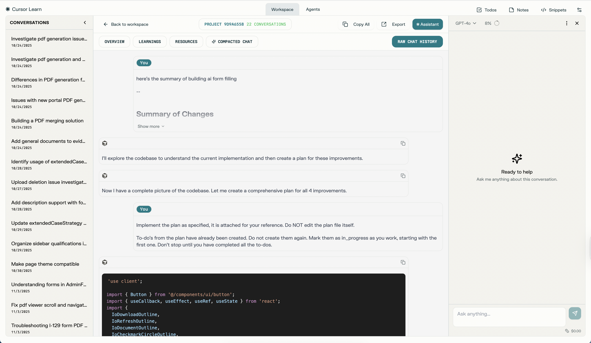

<p align="center">
  
</p>

# Cursor Learn

A desktop app to browse, search, and learn from your Cursor AI conversations.

Built with Nextron (Next.js + Electron), SQLite, and the Vercel AI SDK.

---

## Features

- Browse all your Cursor chat and composer conversations by project
- Full-text search across conversations
- AI summaries and overviews for long conversations
- Resource discovery based on conversation topics
- Notes, snippets, and todos
- Agent chat with your own API keys
- PDF export

---

<p align="center">
  
</p>

## Getting Started

### Prerequisites

- Node.js 20+
- Yarn

### Install

```bash
yarn install
```

### Run

```bash
yarn dev
```

### Build

```bash
yarn build
```

The packaged app outputs to `dist/`.

---

## Configuration

### AI Providers

AI features require an API key from at least one provider. Open Settings in the app and add your key.

Supported providers:
- OpenAI
- Anthropic
- Google (Gemini)
- OpenRouter

### Theme

Pick a theme from Settings. The app ships with multiple themes built-in.

---

## Releasing

Releases are handled via GitHub Actions. The workflow builds on macOS and creates a GitHub release with the DMG.

**Option 1: GitHub UI**

1. Go to Actions > Release workflow
2. Click Run workflow
3. Enter the version (e.g., `1.0.1`)
4. Run

**Option 2: Terminal**

```bash
yarn release
```

Or specify a version directly:

```bash
gh workflow run release.yml -f version=1.0.1
```

---

## License

MIT
