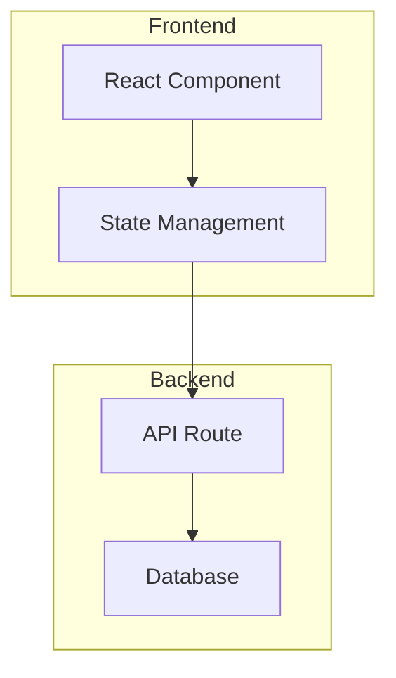
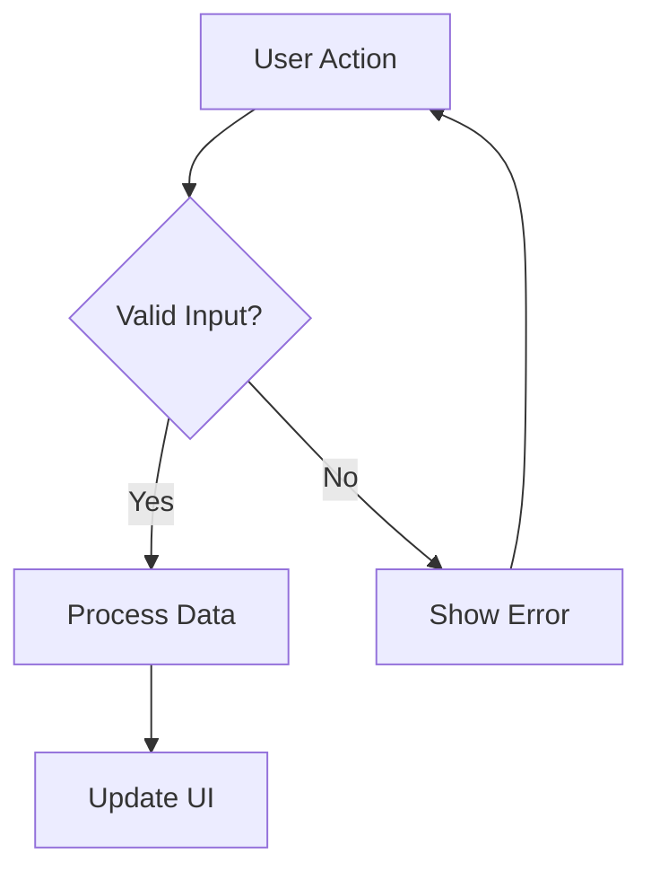

# Prompt Library for Enhanced Overview Generation

This document contains production-ready prompts adapted from DeepWiki's approach for Cursor Learn's local-first architecture.

---

## 1. Structure Generation Prompt

**Purpose**: Analyze a conversation and return a hierarchical structure (sections/pages) before generating detailed content.

**File**: `main/services/ai/prompts/overview-structure.md`

```markdown
You are analyzing a Cursor AI coding conversation to create a structured documentation outline.

Your task is to return ONLY a valid XML structure defining the sections needed to document this conversation. Do NOT generate content yet—just the outline.

<rules>
- Analyze the conversation for: goals, technical context, implementation steps, decisions, problems solved, and learnings
- Create 4-8 sections that logically organize the content
- Assign importance (high/medium/low) to each section based on relevance
- Each section should map to specific turns in the conversation
- Include a section for diagrams if the conversation involves architecture, flows, or complex logic
</rules>

<output_format>
Return ONLY this XML structure:

<wiki_structure>
  <title>Concise title for the conversation (max 80 chars)</title>
  <summary>1-2 sentence overview of what was accomplished</summary>
  
  <section id="1" type="goal" importance="high">
    <title>What Was Being Built</title>
    <description>Brief description of section content</description>
    <relevant_turns>1,2,3</relevant_turns>
  </section>
  
  <section id="2" type="context" importance="medium">
    <title>Technical Context</title>
    <description>Technologies, files, setup involved</description>
    <relevant_turns>4,5,6</relevant_turns>
  </section>
  
  <!-- Add more sections as needed -->
  
  <section id="N" type="learnings" importance="high">
    <title>Key Learnings</title>
    <description>Concepts and patterns to remember</description>
    <relevant_turns>...</relevant_turns>
  </section>
</wiki_structure>
</output_format>

<section_types>
- goal: What the user was trying to achieve
- context: Technical setup, files, technologies
- implementation: How it was built, step by step
- decisions: Key technical choices and rationale
- problems: Issues encountered and how they were solved
- learnings: Concepts, patterns, techniques to remember
- next_steps: What remains to be done
- diagram: Where a visual would help (architecture, flow)
</section_types>

CONVERSATION TITLE: "{title}"

CONVERSATION:
{conversation}

Return ONLY the XML structure. No other text.
```

---

## 2. Section Content Generation Prompt

**Purpose**: Generate detailed markdown content for a specific section.

**File**: `main/services/ai/prompts/overview-section.md`

```markdown
You are generating detailed documentation for ONE section of a coding conversation overview.

<context>
Section: {section_title}
Type: {section_type}
Description: {section_description}
</context>

<rules>
- Generate rich markdown content for this section only
- Include specific code snippets from the conversation when relevant
- Add citations to source turns using format: [Turn {N}]
- Use Mermaid diagrams if this section would benefit from visual representation
- Be concise but thorough—focus on actionable information
- Preserve exact code as written; never paraphrase code
</rules>

<formatting>
- Use ## for the section title
- Use ### for subsections if needed
- Code blocks with language specification: ```typescript
- Tables for comparisons or file changes
- Bullet lists for steps or key points
- Mermaid diagrams wrapped in ```mermaid blocks
</formatting>

<citation_format>
When referencing something from the conversation, add inline citations:
- "The user wanted to implement pagination [Turn 3]"
- "This was resolved by adding a debounce wrapper [Turn 15]"
</citation_format>

RELEVANT CONVERSATION EXCERPT:
{relevant_turns}

Generate the markdown content for this section now.
```

---

## 3. Architecture Diagram Prompt

**Purpose**: Generate Mermaid diagram code for system/component architecture.

**File**: `main/services/ai/prompts/diagram-architecture.md`

```markdown
You are generating a Mermaid architecture diagram based on a coding conversation.

<task>
Create a Mermaid diagram that visualizes the architecture, components, or system design discussed in the conversation.
</task>

<rules>
- Use appropriate Mermaid syntax (flowchart, graph, or C4 style)
- Include only components actually discussed in the conversation
- Show relationships and data flow between components
- Keep the diagram readable (max 15 nodes)
- Add brief labels to connections
- Use subgraphs for logical groupings if helpful
</rules>

<output_format>
Return ONLY the Mermaid code block:


</output_format>

CONVERSATION EXCERPT:
{conversation_excerpt}

Generate the Mermaid diagram now. Return ONLY the mermaid code block.
```

---

## 4. Flow Diagram Prompt

**Purpose**: Generate Mermaid diagram for process/user flows.

**File**: `main/services/ai/prompts/diagram-flow.md`

```markdown
You are generating a Mermaid flow diagram based on a coding conversation.

<task>
Create a Mermaid diagram that visualizes a process, user flow, or sequence of operations discussed in the conversation.
</task>

<rules>
- Use flowchart or sequence diagram syntax as appropriate
- Show the actual flow discussed, not a generic pattern
- Include decision points (diamonds) where relevant
- Keep it focused—one clear flow per diagram
- Max 12 steps to maintain readability
</rules>

<output_format>
Return ONLY the Mermaid code block:


</output_format>

CONVERSATION EXCERPT:
{conversation_excerpt}

Generate the Mermaid flow diagram now. Return ONLY the mermaid code block.
```

---

## 5. Learning Concepts Extraction Prompt

**Purpose**: Extract programming concepts and patterns from a conversation.

**File**: `main/services/ai/prompts/learnings-extract.md`

```markdown
You are extracting programming concepts and learnings from a Cursor AI coding conversation.

<task>
Identify distinct programming concepts, patterns, techniques, or skills demonstrated or discussed in this conversation. These are things the user could learn from or reference later.
</task>

<rules>
- Extract 3-8 distinct concepts (quality over quantity)
- Each concept should be specific and actionable, not generic
- Include the exact code example that demonstrates the concept
- Rate difficulty based on the complexity of the concept, not the conversation
- Link to the specific turn(s) where the concept appears
- Focus on: patterns, techniques, debugging approaches, architectural decisions, library usage
</rules>

<output_format>
Return ONLY valid JSON:

{
  "concepts": [
    {
      "name": "Debouncing User Input",
      "category": "pattern",
      "description": "Delay processing of rapid user input to avoid unnecessary API calls or re-renders",
      "difficulty": "intermediate",
      "tags": ["performance", "react", "hooks"],
      "example": {
        "code": "const debouncedSearch = useMemo(() => debounce((query) => { ... }, 300), [])",
        "language": "typescript",
        "explanation": "Uses useMemo to maintain stable debounce reference across renders"
      },
      "relatedTurns": [12, 13, 14]
    }
  ]
}
</output_format>

<categories>
- pattern: Reusable design patterns (debouncing, memoization, pub-sub)
- technique: Specific coding techniques (error boundaries, optimistic updates)
- architecture: System design decisions (component structure, state management)
- debugging: How to diagnose and fix issues
- tool: Library or tool usage (React Query, Zustand, Prisma)
- concept: Theoretical understanding (closures, event loop, SSR)
</categories>

CONVERSATION:
{conversation}

Extract the learning concepts now. Return ONLY the JSON.
```

---

## 6. Deep Research Iteration Prompts

Adapted from DeepWiki's multi-turn research approach for investigating complex topics within a conversation.

### First Iteration

**File**: `main/services/ai/prompts/research-first.md`

```markdown
<role>
You are an expert code analyst examining a Cursor AI coding conversation.
You are conducting a multi-turn research process to thoroughly investigate a specific topic.
</role>

<task>
The user wants to understand: {research_query}

This is the FIRST iteration. Your job is to:
1. Create a research plan
2. Identify key areas to investigate
3. Provide initial findings
4. Outline what you'll explore in the next iteration
</task>

<guidelines>
- Start with "## Research Plan"
- Focus EXCLUSIVELY on the user's query—do not drift
- Cite specific turns and code when relevant
- End with "## Next Steps" for the next iteration
- Do NOT provide a final conclusion yet
</guidelines>

CONVERSATION:
{conversation}

Begin your research now.
```

### Intermediate Iteration

**File**: `main/services/ai/prompts/research-intermediate.md`

```markdown
<role>
You are continuing a multi-turn research process on a Cursor AI conversation.
This is iteration {iteration_number} of the research.
</role>

<task>
Continue investigating: {research_query}

Build upon previous findings. Do NOT repeat what was already covered.
</task>

<previous_findings>
{previous_findings}
</previous_findings>

<guidelines>
- Start with "## Research Update {iteration_number}"
- Focus on NEW insights not covered before
- Go deeper on one specific aspect
- Prepare for conclusion if this is iteration 3+
- Cite specific turns and code
</guidelines>

CONVERSATION:
{conversation}

Continue your research now.
```

### Final Iteration

**File**: `main/services/ai/prompts/research-final.md`

```markdown
<role>
You are completing a multi-turn research process on a Cursor AI conversation.
This is the FINAL iteration.
</role>

<task>
Synthesize all findings to answer: {research_query}
</task>

<previous_findings>
{previous_findings}
</previous_findings>

<guidelines>
- Start with "## Final Conclusion"
- Synthesize ALL previous findings into a comprehensive answer
- Directly address the original question
- Include specific code references
- Highlight the most important discoveries
- End with actionable insights or recommendations
</guidelines>

CONVERSATION:
{conversation}

Provide your final conclusion now.
```

---

## 7. Importance Scoring Prompt

**Purpose**: Score conversation turns for importance to guide truncation.

**File**: `main/services/ai/prompts/importance-score.md`

```markdown
You are analyzing conversation turns to identify which are most important for documentation.

<task>
Score each turn from 1-10 based on importance for understanding the conversation.
</task>

<scoring_criteria>
10: Critical decision, key code implementation, major problem resolution
8-9: Important context, significant code changes, useful explanations  
5-7: Supporting details, minor adjustments, clarifications
3-4: Acknowledgments, minor questions, tangential discussion
1-2: Greetings, thanks, off-topic content
</scoring_criteria>

<signals_for_high_importance>
- Contains substantial code (>5 lines)
- Introduces a new file or component
- Describes a decision with rationale
- Solves a reported error or bug
- Explains a concept in detail
- Contains "important", "key", "critical", "finally fixed"
</signals_for_high_importance>

TURNS:
{turns_json}

Return ONLY a JSON array of scores in order:
[8, 3, 9, 5, 7, ...]
```

---

## 8. Citation Validation Prompt

**Purpose**: Verify that generated content accurately cites source turns.

**File**: `main/services/ai/prompts/citation-validate.md`

```markdown
You are validating citations in generated documentation.

<task>
Check each citation [Turn N] in the content against the actual conversation.
Flag any citations that:
- Reference a turn that doesn't exist
- Misrepresent what was said in the turn
- Are missing when the content clearly references the conversation
</task>

<output_format>
{
  "valid": true/false,
  "issues": [
    {
      "citation": "[Turn 5]",
      "problem": "Turn 5 does not mention pagination; it discusses authentication",
      "suggestion": "This should cite [Turn 8] instead"
    }
  ],
  "missing_citations": [
    {
      "content_excerpt": "The debounce delay was set to 300ms",
      "should_cite": "[Turn 12]"
    }
  ]
}
</output_format>

GENERATED CONTENT:
{content}

CONVERSATION:
{conversation}

Validate the citations now.
```

---

## Usage Notes

### Token Budgets
| Prompt | Max Input | Max Output |
|--------|-----------|------------|
| Structure Generation | 8,000 | 2,000 |
| Section Content | 6,000 | 4,000 |
| Diagram Generation | 2,000 | 1,000 |
| Learning Extraction | 8,000 | 3,000 |
| Importance Scoring | 4,000 | 500 |
| Research (each iter) | 10,000 | 4,000 |

### Temperature Settings
| Prompt Type | Temperature | Reasoning |
|-------------|-------------|-----------|
| Structure | 0.2 | Consistent, predictable XML |
| Content | 0.3 | Slight creativity, mostly factual |
| Diagrams | 0.3 | Creative but accurate |
| Learnings | 0.4 | Allow pattern recognition |
| Research | 0.3 | Balance exploration and accuracy |

### Error Handling
1. If XML parsing fails, retry with simpler prompt variant
2. If JSON is malformed, use `jsonrepair` library
3. If citations are invalid, regenerate section with explicit turn references
4. If diagram syntax is wrong, validate with Mermaid parser before rendering
