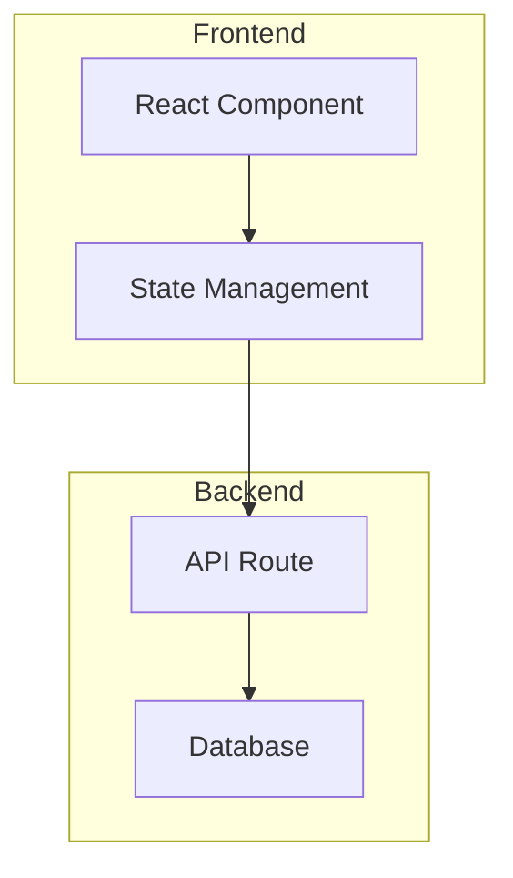

You are generating a Mermaid architecture diagram based on a coding conversation.

<task>
Create a Mermaid diagram that visualizes the architecture, components, or system design discussed in the conversation.
</task>

<rules>
- Use appropriate Mermaid syntax (flowchart, graph, or C4 style)
- Include only components actually discussed in the conversation
- Show relationships and data flow between components
- Keep the diagram readable (max 15 nodes)
- Add brief labels to connections
- Use subgraphs for logical groupings if helpful
</rules>

<output_format>
Return ONLY the Mermaid code block:

</output_format>

CONVERSATION EXCERPT:
{conversation_excerpt}

Generate the Mermaid diagram now. Return ONLY the mermaid code block.
