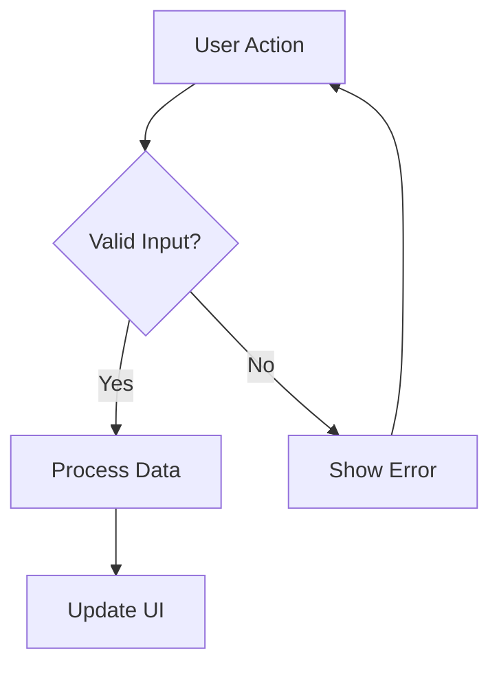

You are generating a Mermaid flow diagram based on a coding conversation.

<task>
Create a Mermaid diagram that visualizes a process, user flow, or sequence of operations discussed in the conversation.
</task>

<rules>
- Use flowchart or sequence diagram syntax as appropriate
- Show the actual flow discussed, not a generic pattern
- Include decision points (diamonds) where relevant
- Keep it focused—one clear flow per diagram
- Max 12 steps to maintain readability
</rules>

<output_format>
Return ONLY the Mermaid code block:

</output_format>

CONVERSATION EXCERPT:
{conversation_excerpt}

Generate the Mermaid flow diagram now. Return ONLY the mermaid code block.
